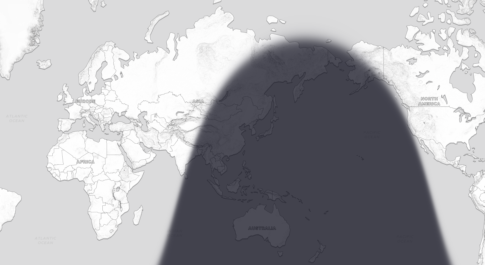
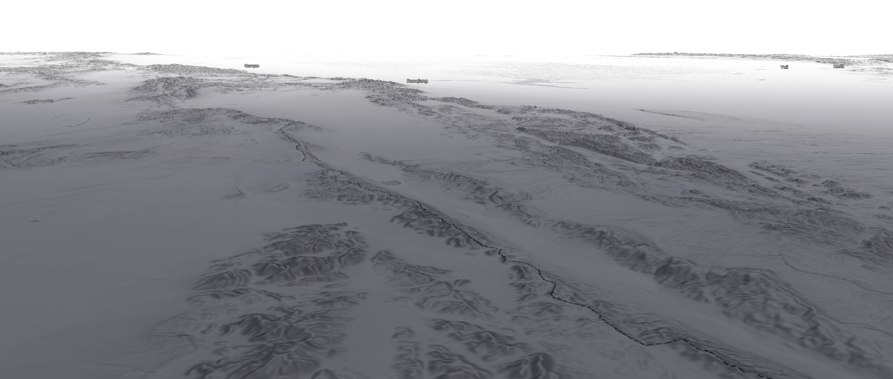
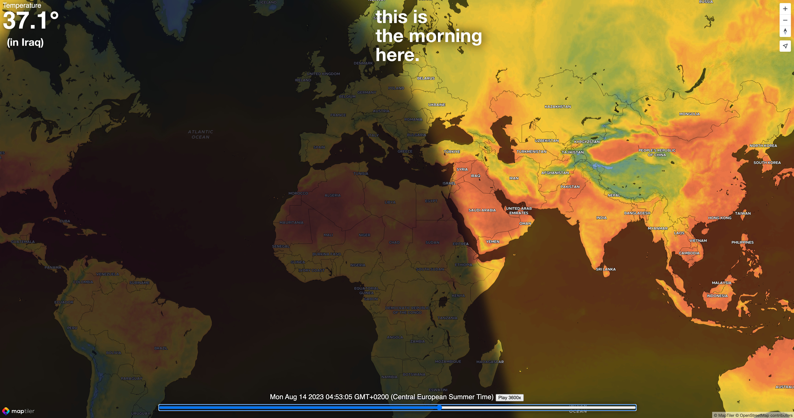
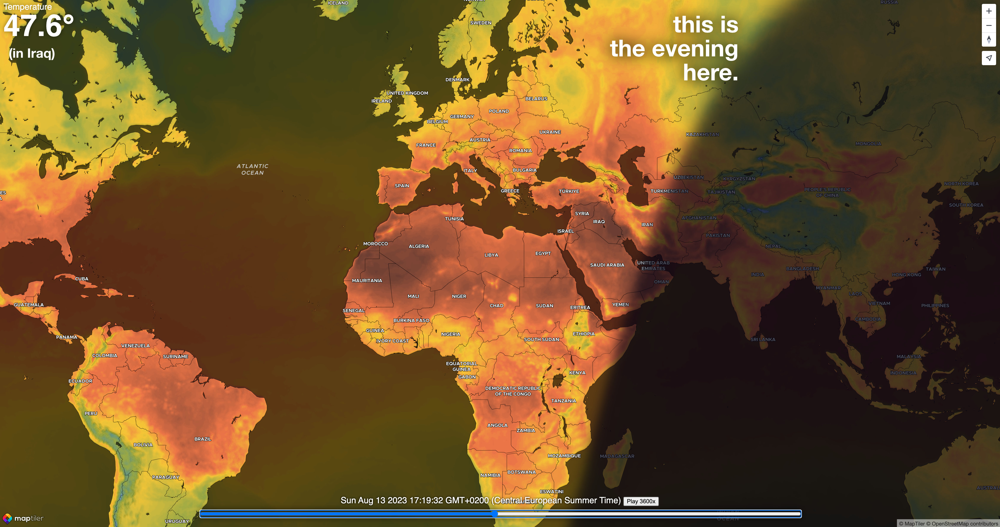

Day/Night layer with twilight zone for [**MapLibre GL JS**](https://maplibre.org/maplibre-gl-js/docs/) and [**MapTiler SDK**](https://docs.maptiler.com/sdk-js/).

Tiles are dynamically generated in the browser (no fetch from API) from zoom level `0` to `22`. The twilight zone (smooth gradient) appears when the sun is between the horizon and -6° below horizon.

```bash
npm install crepuscule
```

This is how it looks like:




Coupled with the `TemperatureLayer` [MapTiler Weather library](https://docs.maptiler.com/sdk-js/modules/weather/):



Crepuscule comes with two different kinds of layers:
- a fixed one that can programmatically be updated to any date and time (`Crepuscule`)
- an automatic one that is being refreshed every 5 seconds to show realtime conditions (`CrepusculeLive`)

Usage of `Crepuscule` with ES Module:
```ts
import {
  Crepuscule
} from "crepuscule";

// You first need to instanciate your Map object from MapLibre or MapTiler SDK.

// Instanciate the Crepuscule instance:
const crepObj = new Crepuscule(map);

// Alternatively with some options:
const crepObj = new Crepuscule(map, {
  color: [0, 12, 55], // RGB in [0, 255]
  opacity: 0.7,       // in [0, 1] 
  date: new Date(),   // any date
  debug: true,        // removes the twilight gradient
});

// You can hide and show the Crepuscule layer:
crepObj.hide();
crepObj.show();

// Alternatively, both hide and show can take some option to make smooth transitions:
crepObj.show({
  duration: 1000,  // Millisconds it takes to fade in or out
  delay: 100,      // Milliseconds it takes to start showing/hiding
});

// You can update the date of the Crepuscule instance
crepObj.setDate(new Date(...));

// Remove the layers and source created by this Crepuscule instance
crepObj.unmount();

// crepObj will no longer be usable after unmounting!
```

Usage of `CrepusculeLive` with ES Module:
```ts
import {
  CrepusculeLive
} from "crepuscule";

// You first need to instanciate your Map object from MapLibre or MapTiler SDK.

// Instanciate the Crepuscule instance:
const crepLiveObj = new crepuscule.CrepusculeLive(map);

// Alternatively with the same options as the simple Crepuscule instance:
const crepLiveObj = new crepuscule.CrepusculeLive(map, {...});

// Once instanciated, the CrepusculeLive will start updating every 5sec
// automatically. Yet it can be stopped and restarted:

crepLiveObj.stop();
crepLiveObj.start();

// A CrepusculeLive can also be unmounted
crepLiveObj.unmount();
```